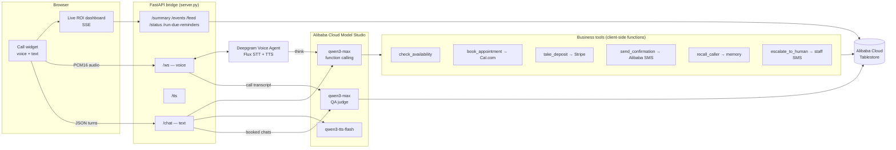
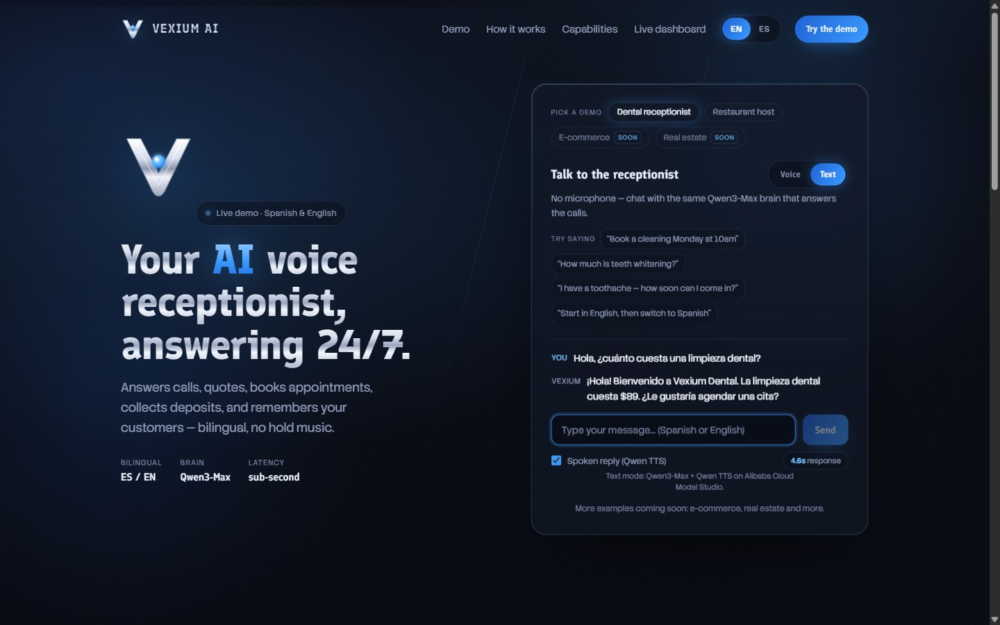

# Vexium Voice — Bilingual AI Receptionist, powered by Qwen on Alibaba Cloud

**An autopilot voice agent that runs a real business workflow end-to-end:** it answers the
phone in Spanish *and* English, quotes services, checks real availability, books the
appointment, texts an SMS confirmation, collects a Stripe deposit for high-value services,
remembers returning customers across calls, schedules no-show reminders, escalates to a
human when it should — and then **grades its own call quality with Qwen as a judge** and
streams the ROI to a live dashboard.

Built for the **[Global AI Hackathon Series with Qwen Cloud](https://qwencloud-hackathon.devpost.com/)**
— Track 4: **Autopilot Agent**.


## Why this matters

Small clinics and restaurants serving the 65-million-strong US Hispanic market lose
bookings every day: calls go unanswered after hours, and many callers simply prefer
Spanish. A missed call is a $89–$3,200 appointment walking away. Vexium answers 100% of
calls, 24/7, in the caller's language — and every call becomes structured data
(a booking, a deposit, a callback request) instead of a voicemail.

## The brain is Qwen — everywhere

| Qwen / Alibaba Cloud service | Where in the code | What it does |
|---|---|---|
| **qwen3-max** (Model Studio, OpenAI-compatible `dashscope-intl` endpoint) | [`qwen_brain.py`](qwen_brain.py) · [`agent_config.py`](agent_config.py) (`_think_block`) | The function-calling brain for BOTH the voice pipeline (as Deepgram Voice Agent's `think` provider) and the text mode. Decides when to check availability, book, charge, recall a caller, or escalate. |
| **qwen3-max as an LLM judge** | [`evaluation.py`](evaluation.py) | Scores every finished conversation: task completion, tool accuracy, hallucination flag. Results stream to the dashboard. |
| **qwen3-tts-flash** | [`integrations/qwen_tts.py`](integrations/qwen_tts.py) | Spoken replies in the no-microphone text demo — the text path is 100% Qwen (brain + voice). |
| **Tablestore** | [`integrations/tablestore_store.py`](integrations/tablestore_store.py) · [`scripts/provision_tablestore.py`](scripts/provision_tablestore.py) | Persists events, bookings, caller memory, tenant configs, and reminders. Powers cross-session memory and the live ROI dashboard. |
| **Alibaba Cloud SMS** | [`integrations/sms.py`](integrations/sms.py) | Booking confirmations, deposit links, reminders, and staff escalation alerts. |
| **Fine-tuned Qwen2.5-7B** (pilot) | [`VexiumZZ/qwen2.5-7b-vexium-voice`](https://huggingface.co/VexiumZZ/qwen2.5-7b-vexium-voice) | Full fine-tune on 273 synthetic dental calls (Qwen2.5-32B teacher) — the path to a self-hosted, per-vertical brain. |

## Architecture



**Voice path:** browser mic → FastAPI WebSocket bridge → Deepgram Voice Agent
(Flux bilingual STT + turn-taking + barge-in), whose **`think` step is qwen3-max on
Model Studio**. Function calls come back to the bridge, run against the business logic,
and results are spoken *and* pushed to the UI as structured data. The ElevenLabs/Aura-2
voice is swapped per detected language (Mexican Spanish ↔ US English) mid-call.

**Text path (zero-setup):** the same qwen3-max brain, called directly through the
OpenAI-compatible DashScope endpoint with the same tools — plus spoken replies via
qwen3-tts-flash. No microphone, no Deepgram key needed.

**Every path ends in Tablestore:** events, bookings, caller memory, reminders — which the
dashboard streams back out over SSE.

## Graceful degradation (run the whole product with zero keys)

Every integration has an honest fallback, so a fresh `git clone` demos end-to-end and the
dashboard's **Cloud stack** panel reports exactly what is real:

| Integration | With credentials | Without credentials |
|---|---|---|
| Qwen brain / judge / TTS | Model Studio (`DASHSCOPE_API_KEY`) | Text mode disabled with a clear 503 (the only required key to demo) |
| Tablestore | Durable multi-tenant store | In-process store, API-identical (`local mode`) |
| Cal.com | Real calendar booking | Simulated booking with confirmation code (`simulated`) |
| Stripe | Real checkout link | Clearly-fake demo link (`simulated`) |
| SMS | Alibaba Cloud SMS (or Twilio) | Skipped, logged (`simulated`) |
| Deepgram voice | Full voice calls | Voice mode offline; text mode unaffected |



## Quickstart

```bash
git clone <this repo> && cd vexium-voice-qwen
python -m venv .venv && . .venv/Scripts/activate   # or source .venv/bin/activate
pip install -r requirements.txt
cp .env.example .env                                # add DASHSCOPE_API_KEY (free tier works)

# 1) the bridge + API
uvicorn server:app --host 0.0.0.0 --port 8000

# 2) the web app
cd web && npm install && npm run dev                # http://localhost:3000
```

- **Text demo (only needs `DASHSCOPE_API_KEY`):** open http://localhost:3000 → pick
  *Text* → chat in Spanish or English. Bookings, tool calls, and the Qwen judge all run.
- **Voice demo:** add `DEEPGRAM_API_KEY` (and optionally ElevenLabs voices) → *Voice* → talk.
- **Dashboard:** http://localhost:3000/dashboard — live KPIs, Qwen judge scores,
  cloud-stack status, activity feed.
- **Tablestore:** create an instance, set the four `TABLESTORE_*` vars, run
  `python scripts/provision_tablestore.py` once. Everything persists from then on.
- **Reminders:** `POST /run-due-reminders` from cron / Alibaba Function Compute timer.

### Tests

```bash
python -m pytest -q        # 44 tests: brain loop, tools, store fallback, reminders,
                           # chat/status/feed endpoints, judge coercion, simulated modes
```

## Repo map

| Path | Purpose |
|---|---|
| `server.py` | FastAPI bridge: voice WS, `/chat`, `/tts`, SSE dashboard API, reminders endpoint |
| `qwen_brain.py` | qwen3-max function-calling loop (validate args → run tool → feed back → reply) |
| `agent_config.py` | System prompts (Sofía/dental, Valentina/restaurant), tool schemas, Deepgram `Settings` with the Qwen `think` block, language detection |
| `clinic.py` / `restaurant.py` | Business logic per vertical: catalogs, availability rules, booking handlers |
| `evaluation.py` | Qwen-as-judge call scoring |
| `memory.py` / `tenants.py` / `metrics.py` / `reminders.py` | Caller memory · multi-tenant config · ROI metrics · reminder scheduling (all on Tablestore) |
| `integrations/` | Tablestore (+ in-memory fallback), Alibaba SMS, Qwen TTS, Cal.com, Stripe |
| `web/` | Next.js app: landing, voice/text call widget, live dashboard |
| `docs/` | Architecture, Alibaba deployment guide, submission materials |

## Status

- Live conversation quality was tuned on a public 24/7 demo (Deepgram + prompt
  engineering iterations, adversarial multi-agent reviews).
- The Qwen migration (this repo) adds: qwen3-max brain (voice think + text mode),
  Qwen judge, Qwen TTS, Tablestore persistence + memory + multi-tenancy, Alibaba SMS,
  Stripe deposits, Cal.com booking, reminders, and the live ROI dashboard.
- Next: Alibaba Cloud ECS deployment (see [docs/DEPLOY_ALIBABA.md](docs/DEPLOY_ALIBABA.md)),
  then Twilio phone numbers for real inbound calls.

## License

[MIT](LICENSE)
