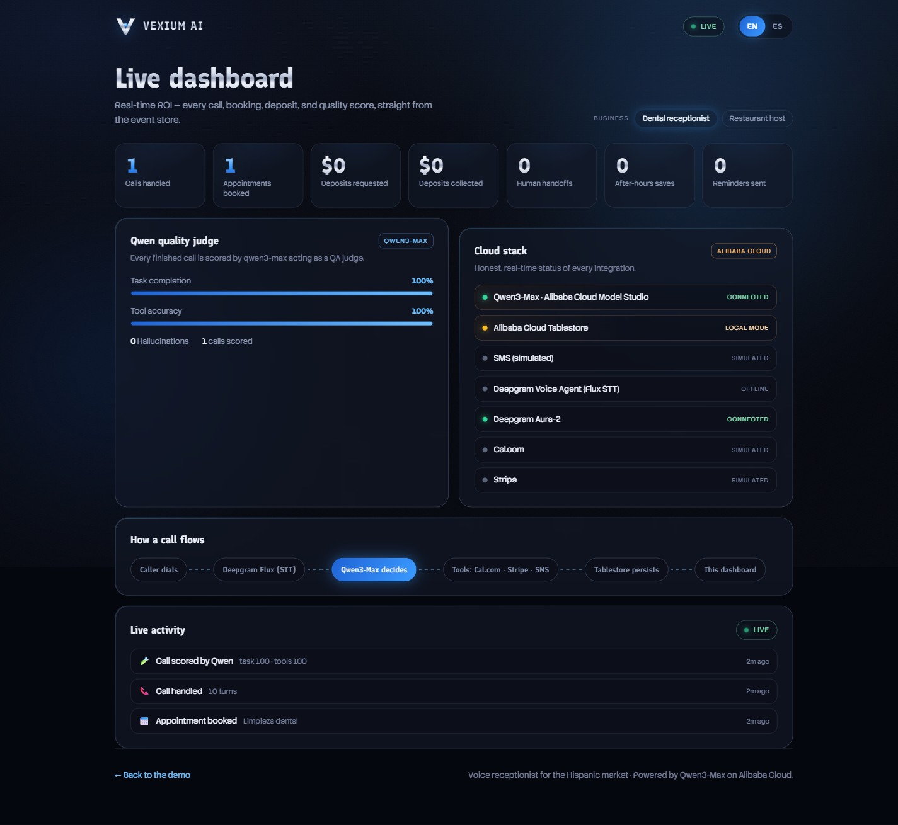

# Vexium Voice

[](https://github.com/Str0k/vexium-voice-qwen/actions/workflows/ci.yml)
[](LICENSE)

A bilingual Spanish/English receptionist reference application built with **FastAPI,
Qwen and Next.js**. It demonstrates tool-driven appointment booking, caller memory,
reminders and a dashboard for conversation events.

**Status:** reference/demo application under active development. The July 2026
hackathon demo is historical; no hosted demo availability is promised.
See [operating boundaries](docs/ARCHITECTURE.md) before deploying.

[Guía en español](docs/QUICKSTART.es.md) · [Contributing](CONTRIBUTING.md) ·
[Architecture](docs/ARCHITECTURE.md) · [Changelog](CHANGELOG.md)



## What it demonstrates

The same business functions serve two conversational paths:

- **Text:** browser → FastAPI → Qwen tool loop → business functions.
- **Voice:** browser audio → FastAPI WebSocket → Deepgram Voice Agent with Qwen →
  business functions.
- **Dashboard:** stored events → FastAPI JSON/SSE endpoints → Next.js dashboard.
- **Quality scoring:** completed voice calls and text bookings can be evaluated by
  a separate Qwen judge. Its scores are model assessments, not human-verified accuracy.

Dental and restaurant examples include simulated availability, reservations,
calendar integration, checkout links, SMS reminders and per-tenant event storage.
All prices, business profiles and example caller data are demonstration data.

## Run locally

Use **Python 3.12 or 3.13**, **uv 0.11.17+**, and **Node 24**.
From PowerShell, bash or another terminal:

```sh
git clone https://github.com/Str0k/vexium-voice-qwen.git
cd vexium-voice-qwen
uv sync --locked
uv run uvicorn server:app --host 127.0.0.1 --port 8000
```

In a second terminal, from the repository root:

```sh
cd web
npm ci
npm run dev
```

Open [localhost:3000](http://localhost:3000), the
[dashboard](http://localhost:3000/dashboard), or the
[HTTP API documentation](http://127.0.0.1:8000/docs).
The backend is local-only with these commands.

Without provider configuration, the UI, API health endpoint and mocked test suite
work. **Live text generation needs a Qwen account and configuration; live voice also
needs Deepgram.** Copy the tracked environment example to a local environment file
only when setting up providers. The configuration reference is in
[.env.example](.env.example). Provider usage may incur charges.

## Integration behavior

Configuration enables the corresponding live integration. Missing configuration
uses the behavior below; the dashboard reflects configuration rather than probing
provider health.

| Integration | Without configuration |
|---|---|
| Qwen text generation | HTTP 503; no generated conversation |
| Qwen speech synthesis | Unavailable; text can still be displayed |
| Deepgram voice | Unavailable; UI uses text mode |
| Tablestore | Process-local memory, cleared on restart |
| Cal.com | Simulated booking |
| Stripe | Simulated checkout link |
| SMS | Skipped; demo reminder processing marks it sent |

The original [Alibaba deployment notes](docs/DEPLOY_ALIBABA.md) and
[hackathon submission](docs/SUBMISSION.md) are historical reference material.

## Verify changes

The Python suite mocks external services. Outbound connections are restricted to
local loopback so tests cannot call cloud services accidentally.

```sh
uv run ruff check .
uv run ruff format --check .
uv run pytest --cov --cov-report=term-missing --cov-fail-under=65
```

From `web`, verify the frontend:

```sh
npm run lint -- --max-warnings=0
npm audit --omit=dev --audit-level=high
npm run build
```

CI runs Python checks on Linux (3.12/3.13) and Windows (3.12), plus frontend checks
on Node 24. The coverage floor prevents regressions; it does not imply that live
calls, provider APIs or production behavior have been fully tested.

## Repository map

| Path | Responsibility |
|---|---|
| `server.py` | HTTP routes, WebSocket lifecycle, orchestration |
| `api_models.py` | Validated HTTP input contracts and OpenAPI schemas |
| `qwen_brain.py` | Bounded model/tool loop |
| `agent_config.py` | Prompts, tool definitions and voice settings |
| `clinic.py`, `restaurant.py` | Demonstration business rules |
| `integrations/` | Calendar, payments, SMS, speech and storage adapters |
| `memory.py`, `metrics.py`, `reminders.py` | Caller history, events and scheduling |
| `web/` | Next.js UI and dashboard |
| `tests/` | Mocked unit and API regression tests |

## Contribute

Start with a reproducible issue or a focused improvement. Installation failures,
voice lifecycle tests, explicit timezone handling and accessibility improvements
are useful contributions. See [CONTRIBUTING.md](CONTRIBUTING.md) for setup and
review expectations.

## License

Released under the [MIT license](LICENSE).
